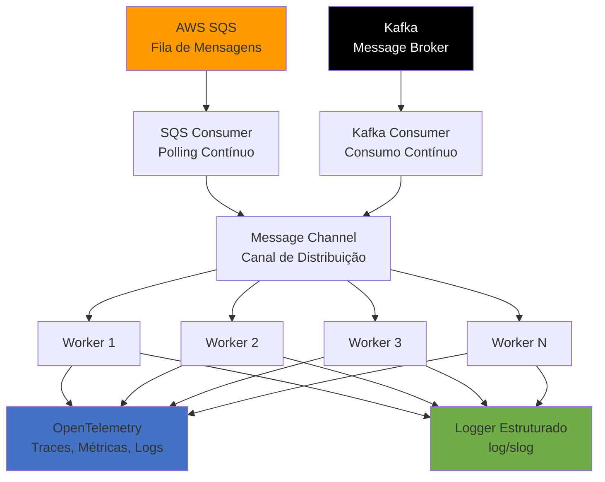
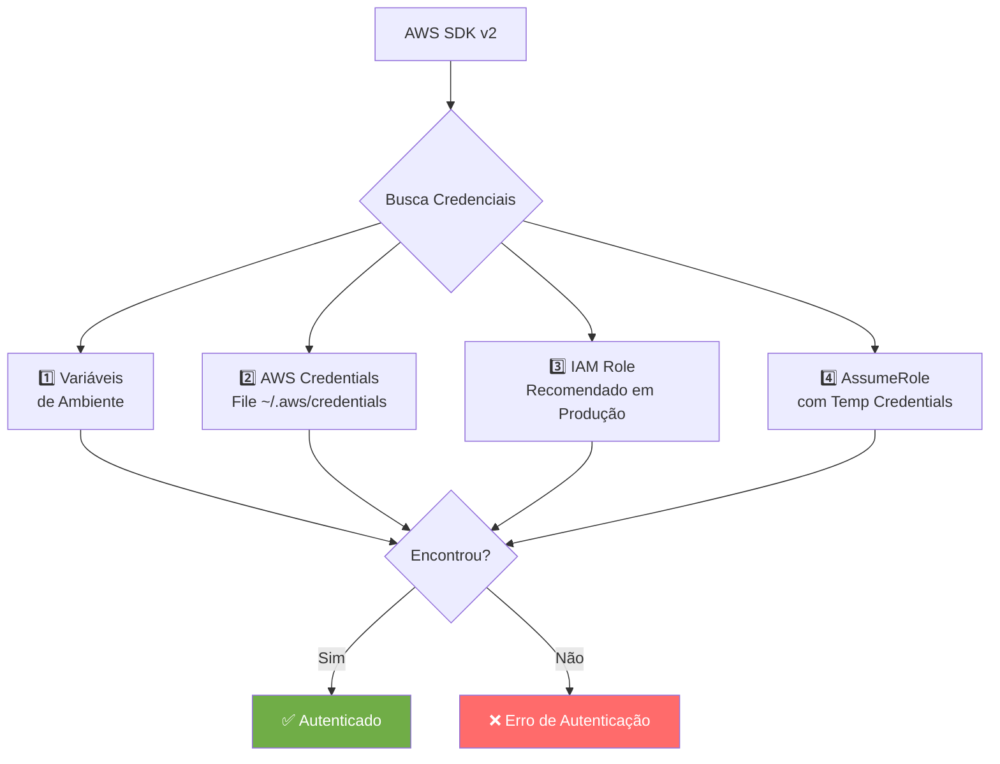
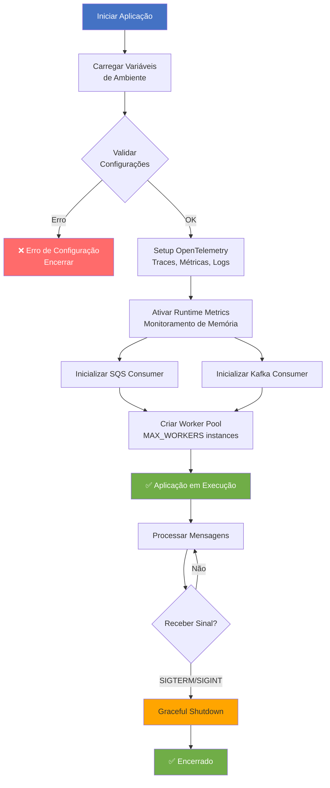
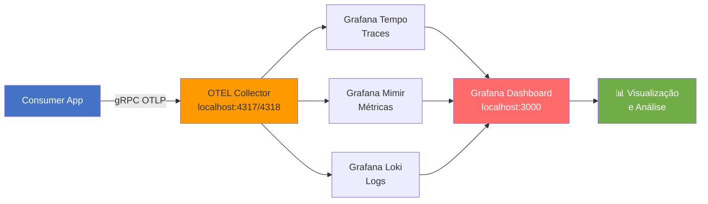
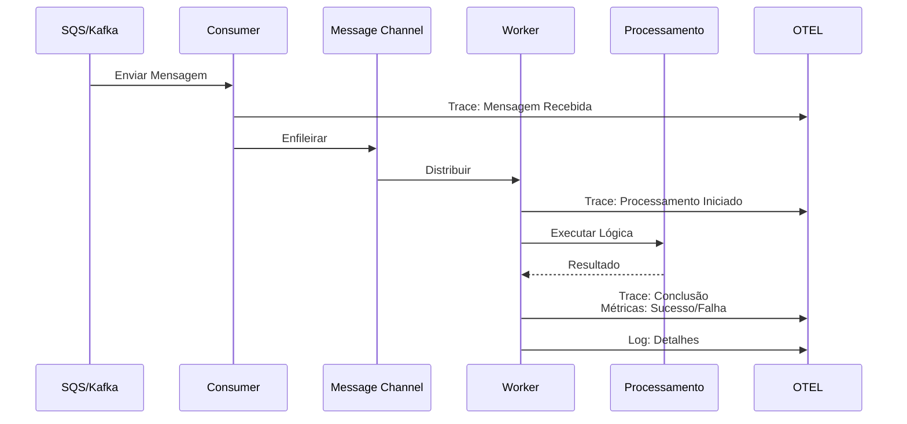
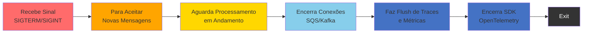
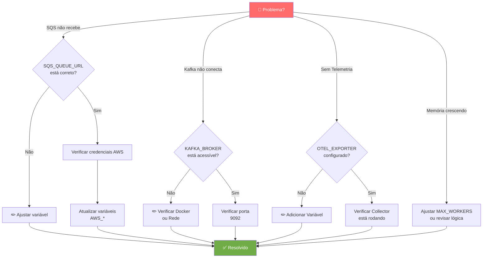
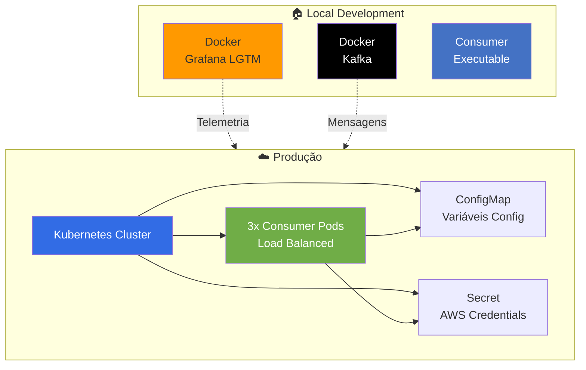

# Consumer - Event Processing Service

Uma aplicação Go robusta e observável para consumir e processar eventos de múltiplas fontes (AWS SQS e Kafka), com instrumentação completa de OpenTelemetry.

## 📋 Visão Geral

O **Consumer** é um serviço de processamento de eventos que:

- Consome mensagens de **AWS SQS** e **Kafka** simultaneamente
- Processa eventos usando um pool de **workers** configurável
- Fornece **observabilidade completa** através de OpenTelemetry (traces, métricas e logs estruturados)
- Suporta integração com **AWS Transfer Family** para orquestração de conectores
- Implementa **tratamento robusto de erros** e **graceful shutdown**

## 🚀 Tecnologias

- **Go 1.25.5**
- **AWS SDK v2** (SQS, DynamoDB, S3, Secrets Manager, Transfer)
- **Kafka** (via segmentio/kafka-go)
- **OpenTelemetry** (traces, métricas, logs distribuídos)
- **Grafana Stack** (LGTM - Loki, Grafana, Tempo, Mimir)

## 📦 Dependências Principais

```go
// AWS Services
github.com/aws/aws-sdk-go-v2/service/sqs
github.com/aws/aws-sdk-go-v2/service/dynamodb
github.com/aws/aws-sdk-go-v2/service/s3
github.com/aws/aws-sdk-go-v2/service/secretsmanager
github.com/aws/aws-sdk-go-v2/service/transfer

// Message Broker
github.com/segmentio/kafka-go

// Observability
go.opentelemetry.io/otel
go.opentelemetry.io/otel/exporters/otlp/otlptrace/otlptracegrpc
go.opentelemetry.io/otel/exporters/otlp/otlpmetric/otlpmetricgrpc
go.opentelemetry.io/otel/exporters/otlp/otlplog/otlploggrpc
```

## 🏗️ Arquitetura



### Componentes

- **SQS Consumer**: Consome mensagens de fila AWS SQS com polling contínuo
- **Kafka Consumer**: Consome mensagens de tópico Kafka
- **Worker Pool**: Pool de tasks que processam mensagens em paralelo (escalável)
- **Message Channel**: Canal Go que distribui mensagens aos workers
- **OTEL SDK**: Coleta traces, métricas e logs estruturados
- **Logger**: Sistema de logs estruturado com contexto distribuído

## 🔧 Configuração

### Variáveis de Ambiente

| Variável | Descrição | Obrigatória | Exemplo |
|----------|-----------|------------|---------|
| `OTEL_SERVICE_NAME` | Nome do serviço para telemetria | ✅ | `consumer` |
| `SQS_QUEUE_URL` | URL da fila AWS SQS | ✅ | `https://sqs.{region}.amazonaws.com/{account}/queue-name` |
| `KAFKA_BROKER` | Endereço do broker Kafka | ✅ | `localhost:9092` |
| `KAFKA_TOPIC` | Tópico Kafka para consumir | ✅ | `topic1` |
| `KAFKA_CONSUMER_GROUP` | Grupo de consumo Kafka | ✅ | `consumer1` |
| `MAX_WORKERS` | Número de workers para processamento | ❌ | `10` (padrão) |
| `OTEL_EXPORTER_OTLP_ENDPOINT` | Endpoint do collector OTLP | ❌ | `http://localhost:4317` |

### Credenciais AWS

A aplicação utiliza o **AWS SDK v2** que suporta múltiplas formas de autenticação:



Para usar credenciais temporárias da AWS:

```bash
# Obter credenciais temporárias
aws sts get-session-token --duration-seconds 3600

# Configurar variáveis de ambiente
set AWS_ACCESS_KEY_ID=<ACCESS_KEY>
set AWS_SECRET_ACCESS_KEY=<SECRET_KEY>
set AWS_SESSION_TOKEN=<TOKEN>
```

## 📚 Estrutura de Arquivos

```mermaid
graph TD
    ROOT["consumer/"]
    ROOT --> GOMOD["go.mod<br/>Definição do módulo"]
    ROOT --> GOSUM["go.sum<br/>Checksums"]
    ROOT --> MAIN["main.go<br/>Entrada & Inicialização"]
    ROOT --> WORKER["worker.go<br/>Pool de Workers"]
    ROOT --> SQS["sqs_consumer.go<br/>Consumer SQS"]
    ROOT --> KAFKA["kafka_consumer.go<br/>Consumer Kafka"]
    ROOT --> MSG["message_context.go<br/>Contexto de Mensagem"]
    ROOT --> ORCH["orchestrator.go<br/>Orquestrador"]
    ROOT --> OTEL["otel.go<br/>Configuração OpenTelemetry"]
    ROOT --> UTILS["utils.go<br/>Funções Utilitárias"]
    ROOT --> README["README.md<br/>Documentação"]
    ROOT --> GIT[".gitignore<br/>Git Ignore"]
    
    style ROOT fill:#4472C4,color:#fff
    style MAIN fill:#70AD47
    style GOMOD fill:#FF9900
    style OTEL fill:#4472C4
```



## 🚀 Como Executar

### Fluxo de Inicialização



- **Go 1.25.5+** instalado
- **Docker** (para services auxiliares)
- **Credenciais AWS** configuradas

### Build

```bash
# Clonar repositório
git clone https://github.com/flcamillo/consumer.git

# Compilar
go build -o consumer.exe

# Ou usando make (se disponível)
make build
```

### Executar Localmente

#### 1. Iniciar Stack de Observabilidade (Grafana LGTM)

```bash
docker run -d \
  -p 3000:3000 \
  -p 4317:4317 \
  -p 4318:4318 \
  --rm \
  --name lgtm \
  grafana/otel-lgtm:latest

# Acessar Grafana em: http://localhost:3000
```

#### 2. Iniciar Kafka

```bash
# Iniciar broker Kafka
docker run -d \
  -p 9092:9092 \
  --rm \
  --name broker \
  apache/kafka:latest

# Criar tópico
docker exec --workdir /opt/kafka/bin/ -it broker sh
./kafka-topics.sh --bootstrap-server localhost:9092 --create --topic topic1

# (Opcional) Enviar mensagem de teste
./kafka-console-producer.sh --bootstrap-server localhost:9092 --topic topic1
# Digite uma mensagem e pressione Enter
```

#### 3. Configurar Variáveis de Ambiente

```bash
# Windows (PowerShell)
$env:OTEL_SERVICE_NAME = "consumer"
$env:SQS_QUEUE_URL = "https://sqs.sa-east-1.amazonaws.com/{account-id}/queue-name"
$env:KAFKA_BROKER = "localhost:9092"
$env:KAFKA_TOPIC = "topic1"
$env:KAFKA_CONSUMER_GROUP = "consumer1"
$env:MAX_WORKERS = "5"
$env:OTEL_EXPORTER_OTLP_ENDPOINT = "http://localhost:4317"

# Windows (cmd)
set OTEL_SERVICE_NAME=consumer
set SQS_QUEUE_URL=https://sqs.sa-east-1.amazonaws.com/{account-id}/queue-name
set KAFKA_BROKER=localhost:9092
set KAFKA_TOPIC=topic1
set KAFKA_CONSUMER_GROUP=consumer1
set MAX_WORKERS=5
set OTEL_EXPORTER_OTLP_ENDPOINT=http://localhost:4317
```

#### 4. Executar Consumer

```bash
.\consumer.exe

# Ou diretamente com Go
go run main.go kafka_consumer.go sqs_consumer.go worker.go orchestrator.go message_context.go otel.go utils.go
```

#### 5. Monitorar em Grafana

Acesse http://localhost:3000 com as credenciais padrão:
- **Usuário**: admin
- **Senha**: admin

## 📊 Observabilidade

### Fluxo de Telemetria



### OpenTelemetry Exporters

O serviço exporta dados via **gRPC OTLP** para:

- **Traces**: Grafana Tempo
- **Métricas**: Grafana Mimir
- **Logs**: Grafana Loki

### Métricas Personalizadas

| Métrica | Tipo | Descrição | Unidade |
|---------|------|-----------|---------|
| `custom.sqsconsumer.messages.received` | Counter | Mensagens recebidas da SQS | messages |
| `custom.KafkaConsumer.messages.received` | Counter | Mensagens recebidas do Kafka | messages |
| `custom.worker.messages.processed` | Counter | Mensagens processadas com sucesso | messages |
| `custom.worker.messages.failed` | Counter | Mensagens que falharam | messages |
| `custom.sqsconsumer.messages.wait.duration` | Histogram | Tempo de espera (SQS) | s |
| `custom.KafkaConsumer.messages.wait.duration` | Histogram | Tempo de espera (Kafka) | s |
| `custom.worker.messages.wait.duration` | Histogram | Tempo de espera antes do processamento | s |

### Traces

Cada operação gera spans com informações de:
- Duração
- Status (sucesso/erro)
- Atributos contextuais
- Logs detalhados

### Logs Estruturados

Utiliza `log/slog` com integração OpenTelemetry para logs estruturados com contexto distribuído.

## ⚙️ Processamento de Mensagens

### Ciclo de Vida



### Tratamento de Erros

- Tentativas automáticas com backoff
- Logs estruturados de erros com contexto
- Spans de telemetria marcam erros
- Graceful degradation em falhas não-críticas

## 🛑 Graceful Shutdown

A aplicação escuta sinais:
- `SIGTERM`: Encerramento ordenado
- `SIGINT`: Interrupção (Ctrl+C)



## 🔐 Segurança

- ✅ Credenciais via variáveis de ambiente (não hardcoded)
- ✅ Suporte a AWS IAM Roles
- ✅ Tokens de sessão temporários
- ✅ Contexto distribuído rastreável
- ✅ Logging estruturado para auditoria

## 🧪 Testes

### Teste Manual com Kafka

```bash
# Terminal 1: Iniciar produtor
docker exec -it broker /opt/kafka/bin/kafka-console-producer.sh \
  --bootstrap-server localhost:9092 \
  --topic topic1

# Digite mensagens para enviar

# Terminal 2: Monitorar logs/telemetria
# A aplicação consumer receberá e processará as mensagens
```

### Teste com SQS (Local)

Para testes locais com SQS, considere usar **LocalStack**:

```bash
docker run -d \
  -p 4566:4566 \
  --name localstack \
  localstack/localstack:latest

# Configurar SQS_QUEUE_URL para endpoint local
```

## 📈 Performance

- **Throughput**: Configurável via `MAX_WORKERS`
- **Latência**: Rastreada em spans de telemetria
- **Retenção**: Configurável por fonte (SQS/Kafka)

### Tuning

Para aumentar throughput:

```bash
set MAX_WORKERS=20
```

Para reduzir latência:
- Reduzir timeout de polling
- Aumentar batch size de pull
- Otimizar lógica de processamento

## 🐛 Troubleshooting



### Problemas Comuns

| Problema | Verificação | Solução |
|----------|-----------|---------|
| SQS falha | `SQS_QUEUE_URL` | Verificar URL e credenciais AWS |
| Kafka falha | `KAFKA_BROKER` acessível | Verificar Docker, porta 9092 |
| Sem Telemetria | `OTEL_EXPORTER_OTLP_ENDPOINT` | Configurar e iniciar Grafana LGTM |
| Memória crescendo | Métricas de runtime | Ajustar `MAX_WORKERS` |

## 📝 Logging

A aplicação usa `log/slog` com níveis:

- **INFO**: Eventos normais (start/stop)
- **WARN**: Condições inesperadas
- **ERROR**: Falhas na operação

Exemplo de log estruturado:
```
time=2024-03-24T10:30:45.123Z level=INFO msg="starting SqsConsumer..." service.name=consumer
time=2024-03-24T10:30:46.456Z level=INFO msg="message received" service.name=consumer trace_id=abc123 span_id=def456
```

## 🚀 Deployment

### Topologia de Deployment



### Docker

Construir imagem:

```dockerfile
FROM golang:1.25.5 as builder
WORKDIR /app
COPY . .
RUN go build -o consumer

FROM debian:bookworm-slim
COPY --from=builder /app/consumer /usr/local/bin/
EXPOSE 4317 4318
CMD ["consumer"]
```

Executar container:

```bash
docker build -t consumer:latest .
docker run -d \
  -e OTEL_SERVICE_NAME=consumer \
  -e SQS_QUEUE_URL=https://sqs.region.amazonaws.com/account/queue \
  -e KAFKA_BROKER=kafka:9092 \
  consumer:latest
```

### Kubernetes

Deploy com 3 replicas:

```yaml
apiVersion: apps/v1
kind: Deployment
metadata:
  name: consumer
  namespace: default
spec:
  replicas: 3
  selector:
    matchLabels:
      app: consumer
  template:
    metadata:
      labels:
        app: consumer
    spec:
      containers:
      - name: consumer
        image: consumer:latest
        imagePullPolicy: Always
        env:
        - name: OTEL_SERVICE_NAME
          value: "consumer"
        - name: MAX_WORKERS
          valueFrom:
            configMapKeyRef:
              name: consumer-config
              key: max-workers
        - name: AWS_ACCESS_KEY_ID
          valueFrom:
            secretKeyRef:
              name: aws-credentials
              key: access-key-id
        - name: AWS_SECRET_ACCESS_KEY
          valueFrom:
            secretKeyRef:
              name: aws-credentials
              key: secret-access-key
        resources:
          requests:
            memory: "256Mi"
            cpu: "250m"
          limits:
            memory: "512Mi"
            cpu: "500m"
        livenessProbe:
          exec:
            command:
            - /bin/sh
            - -c
            - ps aux | grep consumer || exit 1
          initialDelaySeconds: 10
          periodSeconds: 10
```

## 📄 Licença

[Especificar licença do projeto]

## 👥 Contribuintes

[Lista de contribuintes]

## 📞 Suporte

Para questões e suporte, abra uma **issue** no repositório de origem.

---

**Última atualização**: Março de 2024
